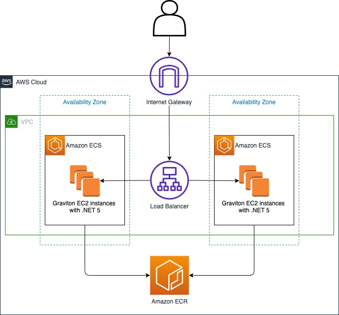
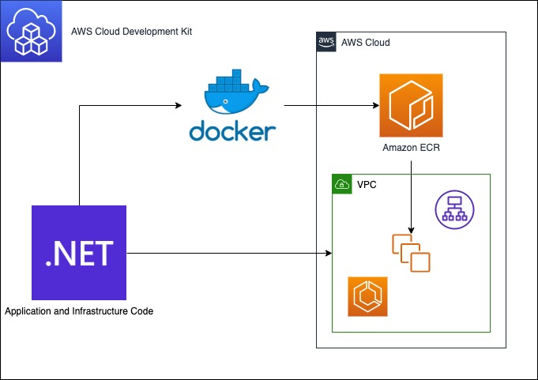
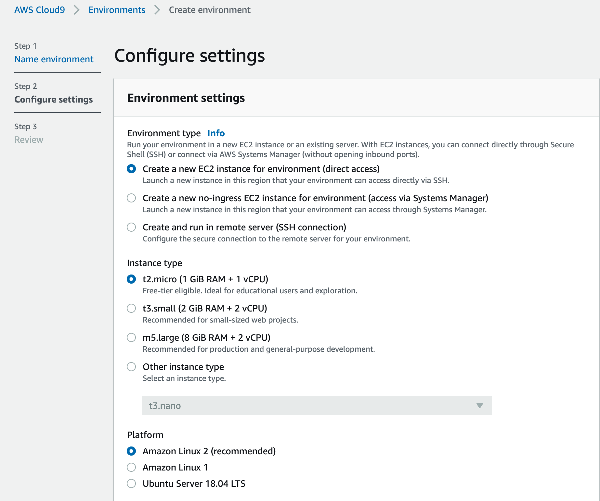
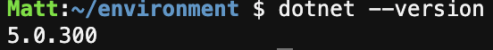
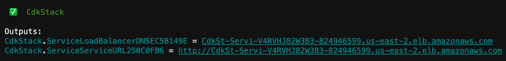
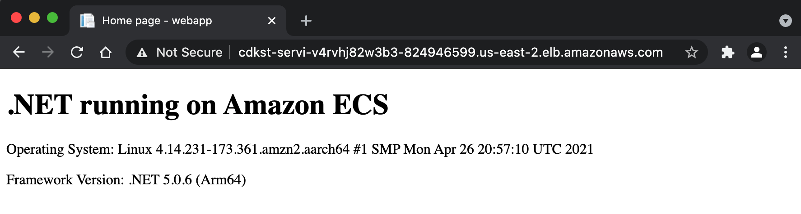
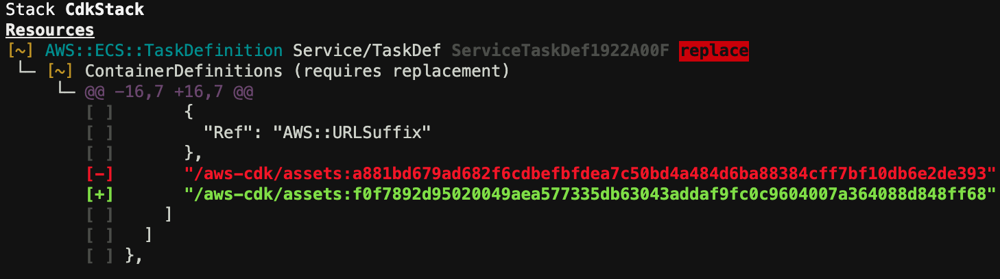
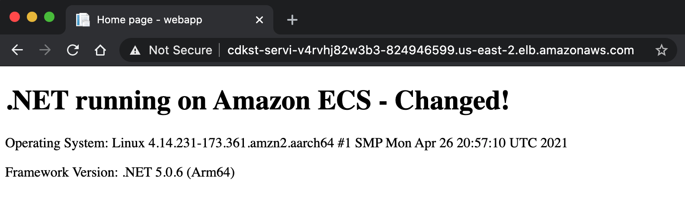

## Build and deploy .NET web applications to Arm-powered AWS Graviton 2 Amazon ECS Clusters using AWS CDK


With .NET providing first-class support for Arm architecture, running .NET applications on an AWS Graviton processor provides you with more choices to help optimize performance and cost. We have already written about .NET 5 with Graviton benchmarks; in this post, we explore how C#/.NET developers can take advantages of Graviton processors and obtain this performance at scale with Amazon Elastic Container Service (Amazon ECS).


In addition, we take advantage of infrastructure as code (IaC) by using the AWS Cloud Development Kit (AWS CDK) to define the infrastructure.

The AWS CDK is an open-source development framework to define cloud applications in code. It includes constructs for Amazon ECS resources, which allows you to deploy fully containerized applications to AWS.

---------------
### Architecture
---------------

Our target architecture for our .NET application running in AWS is a load balanced ECS cluster, as shown in the following diagram.


<p align="center">
  
</p>

We need to provision quite a few components in this architecture, but this is where the AWS CDK comes in. AWS CDK is an open source-software development framework to define cloud resources using familiar programming languages. You can use it for the following:

* A multi-stage .NET application container build
* reate an Amazon Elastic Container Registry (Amazon ECR) repository and push the Docker image to it
* Use IaC written in .NET to provision the preceding architecture

The following diagram illustrates how we use these services.

<p align="center">
  
</p>


---------------
### Configure AWS Cloud9 Development Environment
---------------

To deploy this solution on AWS, we use the AWS Cloud9 development environment.

1.	On the AWS Cloud9 console, choose Create environment.
2.	For Name, enter a name for the environment.
3.	Choose Next step.


4.	On the Environment settings page, keep the default settings:
    * Environment type – Create a new EC2 instance for the environment (direct access)
    * Instance type – t2.micro (1 Gib RAM + 1 vCPU)
    * Platform – Amazon Linux 2(recommended)

<p align="center">
  
</p>

5.	Choose Next step.
6.	Choose Create environment.

When the Cloud9 environment is ready, proceed to the next section.

---------------
### Install the .NET SDK
---------------

The AWS development tools we require will already be setup in the Cloud9 environment, however the .NET SDK will not be available.

Install the .NET SDK with the following code:

```bash
curl -sSL https://dot.net/v1/dotnet-install.sh | bash /dev/stdin -c 5.0
export PATH=$PATH:$HOME/.local/bin:$HOME/bin:$HOME/.dotnet
```


Verify the expected version has been installed:

```bash
dotnet --version
```

<p align="center">
  
</p>

---------------
### Clone this repository
---------------
Clone the example repository:

```bash
git clone https://github.com/aws-samples/aws-cdk-dotnet-graviton-ecs-example.git
```

This repository contains two .NET projects, the web application, and the IaC application using the AWS CDK.

The unit of deployment in the AWS CDK is called a stack. All AWS resources defined within the scope of a stack, either directly or indirectly, are provisioned as a single unit.

The stack for this project is located within /cdk/src/Cdk/CdkStack.cs. When we read the C# code, we can see how it aligns with the architecture diagram at the beginning of this post.

First, we create a virtual private cloud (VPC) and assign a maximum of two Availability Zones:

```csharp
var vpc = new Vpc(this, "DotNetGravitonVpc", new VpcProps { MaxAzs = 2 });
```

Next, we define the cluster and assign it to the VPC:

```csharp
var cluster = new Cluster(this, "DotNetGravitonCluster", new ClusterProps { Vpc = vpc });
```
The Graviton instance type (c6g.4xlarge) is defined in the cluster capacity options:

```csharp
cluster.AddCapacity("DefaultAutoScalingGroupCapacity",
    new AddCapacityOptions
    {
        InstanceType = new InstanceType("c6g.4xlarge"),
        MachineImage = EcsOptimizedImage.AmazonLinux2(AmiHardwareType.ARM)
    });
```
Finally, ApplicationLoadBalancedEC2Service is defined, along with a reference to the application source code:

```csharp
new ApplicationLoadBalancedEc2Service(this, "Service",
    new ApplicationLoadBalancedEc2ServiceProps
    {
        Cluster = cluster,
        MemoryLimitMiB = 8192,
        DesiredCount = 2,
        TaskImageOptions = new ApplicationLoadBalancedTaskImageOptions
        {
            Image =  ContainerImage.FromAsset(Path.Combine(Directory.GetCurrentDirectory(), @"../app")),                        
        }                             
    });

```
With about 30 lines of AWS CDK code written in C#, we achieve the following:

* Build and package a .NET application within a Docker image
* Push the Docker image to Amazon ECR
* Create a VPC with two Availability Zones
* Create a cluster with a Graviton c6g.4xlarge instance type that pulls the Docker image from Amazon ECR

The AWS CDK has several useful helpers, such as the FromAsset function:

```csharp
Image =  ContainerImage.FromAsset(Path.Combine(Directory.GetCurrentDirectory(), @"../app")),  
```

The ContainerImage.FromAsset function instructs the AWS CDK to build the Docker image from a Dockerfile, automatically create an Amazon ECR repository, and upload the image to the repository.

For more information about the ContainerImage class, see Class ContainerImage. 

---------------
### Build and deploy the project with the AWS CDK Toolkit
---------------

The AWS CDK Toolkit, the CLI command cdk, is the primary tool for interaction with AWS CDK apps. It runs the app, interrogates the application model you defined, and produces and deploys the AWS CloudFormation templates generated by the AWS CDK. 

If an AWS CDK stack being deployed uses assets such as Docker images, the environment needs to be bootstrapped. From the /cdk directory:

```bash
cdk bootstrap
```

Now you can deploy the stack into the AWS account with the deploy command:

```bash
cdk deploy
```

The AWS CDK Toolkit synthesizes fresh CloudFormation templates locally before deploying anything. The first time this runs, it has a changeset that reflects all the infrastructure defined within the stack and prompts you for confirmation before running.

When the deployment is complete, the load balancer DNS is in the Outputs section.

<p align="center">
  
</p>

You can navigate to the load balancer address via a browser.

<p align="center">
  
</p>

---------------
### Deal with change
---------------

To support changes, the AWS CDK Toolkit queries the AWS account for the last deployed CloudFormation template for the stack and compares it with the locally generated template. Preview the changes with the following code:

```bash
cdk diff
```

For example, if a simple text change within the application’s home page HTML (index.cshtml) is made, a difference is detected within the assets, but not all the infrastructure as per the first deploy.

<p align="center">
  
</p>

Running cdk deploy again now rebuilds the Docker image, uploads it to Amazon ECR, and refreshes the containers within the ECS cluster.

```bash
cdk deploy
```

<p align="center">
  
</p>

---------------
### Clean up
---------------

Remove the resources you created in this post with the following code: 

```bash
cdk destroy
```


---------------
### Conclusion
---------------

Using the AWS CDK to provision infrastructure in .NET provides rigor, clarity, and reliability in a language familiar to .NET developers. For more information, see Infrastructure as Code.

This post demonstrates the low barrier to entry for .NET developers wanting to apply modern application development practices while taking advantage of the price performance of Arm-based processors such as Graviton.

Building and deploying .NET applications on AWS has never been easier. For more information, see Build .NET applications on AWS. 


## Security

See [CONTRIBUTING](CONTRIBUTING.md#security-issue-notifications) for more information.

## License

This library is licensed under the MIT-0 License. See the LICENSE file.
